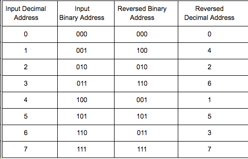

# 比赛题目

## **初赛题目**

### 初级题

- **快速傅立叶变换(FFT)**  
  1）	框架代码下载  
  >下载链接  
    您可以直接在框架代码中“//Insert your code here”处实现算法基本功能，也可以根据您的设计对其适当的修改。  
    但请注意：
    **您必须保持顶层函数“void fft(DTYPE X_R[SIZE], DTYPE X_I[SIZE], DTYPE OUT_R[SIZE], DTYPE OUT_I[SIZE]) ”不变。**

  2）项目要求  
  >在本项目中，FFT实现分为多个阶段。FFT的第一阶段使用位反转方案对输入数据进行重新排序，即框架代码中的 bit_reverse 函数。8点FFT的位反转数据的示例如下：

  

  第二阶段则需要logN（N为输入数据的个数）个stage进行蝶形计算，在框架代码中分为了“fft_stage_first”，“fft_stages”和“fft_stage_last”三个函数。  

  在设计完成后，您可以使用我们提供的fft_test.cpp文件进行基本功能测试。**在HLS优化的过程中，请务必将优化指令设置为pragma写入c++代码中。**

  3）提交程序
  >您仅需提交fft.cpp和fft.h文件。请将fft.cpp和fft.h文件压缩为一个压缩包fft.zip，在题目的提交窗口点击文本框上方“上传文件”按钮进行提交，稍待片刻即可在文本框下方得知您的设计是否通过了基本功能测试。延迟、面积等性能指标则可在历史提交记录中点击版本号详细查看。

- **索贝尔滤波器（Sobel Filter**

  1）	框架代码下载  
  >下载链接  
  >您可以直接在框架代码中“//Insert your code here”处实现算法基本功能，也可以根据您的设计对其适当的修改。  
  >但请注意：  
  >**您必须保持顶层函数“void sobel(PIXEL* src, PIXEL* dst, int rows, int cols)”不变。**

  2）项目要求  
  >在本项目中，输入的图像已经被转化为了一个大小为720\*1280的1D array **src**。**Sobel Filter统一不做padding**，这样经过滤波后得到的输出**dst**是一个大小为718\*1278的1D array。在滤波过程中，框架代码sobel3x3_kernel函数中使用了3*3的kernel：  
  >GX=[−1 0 1 −2 0 2 −1 0 1]∗I  
  >Gy=[−1 −2 −1 0 0 0 1 2 1]∗I    
  >您可以在函数Gradient_X以及Gradient_Y实现具体功能。  
  >在设计完成后，您可以使用我们提供的sobel_test.cpp文件进行基本功能测试。**在HLS优化的过程中，请务必将优化指令设置为pragma写入c++代码中。**
	
  3）提交程序
  >您仅需提交fft.cpp和fft.h文件。请将fft.cpp和fft.h文件压缩为一个压缩包fft.zip，在题目的提交窗口点击文本框上方“上传文件”按钮进行提交，稍待片刻即可在文本框下方得知您的设计是否通过了基本功能测试。延迟、面积等性能指标则可在历史提交记录中点击版本号详细查看。

### 中级题

1.Training of Random Forest Model  

  > Random forest is an ensemble learning method that consisting a multitude of decision trees at training time and outputting the mode of the classes (classification) or mean prediction (regression) of the trees.  
  [**Source code**](https://github.com/Xilinx/Vitis_Libraries/tree/master/data_analytics/L2/tests/classification/randomforest)

2.Training of SVM Model
  > SVM (Support Vector Machine) is a model to predict sample’s classification. The svm_train function that trains a batch of samples using support vector machine model and output a weight vector for classification.  
[**Source code**](https://github.com/Xilinx/Vitis_Libraries/tree/master/data_analytics/L2/tests/classification/svm)

3.Regular Expression Engine
  > The regex-VM aims at the work of converting unstructured texts, like log files, into structured ones  
[**Source code**](https://github.com/Xilinx/Vitis_Libraries/tree/master/data_analytics/L2/tests/text/reEngine)

### 高级题3个

- Minimum Spanning Tree  
  > A minimum spanning tree is a subset of the edges of a weighted graph that connects all the vertices together. without any cycles and with the minimum possible total weight.

- K-1 Coloring
  >The K-1 Coloring algorithm assigns a color to every node in the graph, trying to optimize for two objectives:  
  > - To make sure that every neighbor of a given node has a different color than the node itself. 
  > - To use as few colors as possible.

- Estimated Diameter
  >The diameter of a graph is the greatest distance between any pair of vertices. The estimated diameter problem tries to find a distance that is close to the graph diameter as much as possible.

## **决赛题目**

### 中级题3选一

- Training of Decision Tree Model
  >Decision Tree (Classification/Regression) is a model to predict sample’s classification or regression value.  
  >[Source code](https://github.com/Xilinx/Vitis_Libraries/tree/master/data_analytics/L2/tests/classification/decisiontree)

- Training of kMeans Model
  >Fits new centers based native k-means using the existed samples and initial centers provide by user.  
  >[Source code](https://github.com/Xilinx/Vitis_Libraries/tree/master/data_analytics/L2/tests/clustering/kmeans)

- CSR/CSC Converter
  >The CSR/CSC converter function tries to convert a sparse matrix from the compressed sparse column (CSC) format to the compressed sparse row (CSR) format.  
  >[Source code](https://github.com/Xilinx/Vitis_Libraries/tree/master/graph/L2/tests/convert_csc_csr)

### 高级题3选一

- Random Walk
  >A random walk means that we start at one vertex, choose a neighbor to navigate to at random or based on a provided probability distribution, and then do the same from that vertex, keeping the resulting path in a list.

- Closeness Centrality
  >Calculate the closeness centrality of a given vertex. The closeness centrality of a vertex measures its average farness (inverse distance) to all other vertices. Vertices with a high closeness score have the shortest distances to all other vertices.

- Overlap Similarity
  >Calculate the overlap similarity of two vertices in a graph. The overlap similarity is computed using the following formula
  >

